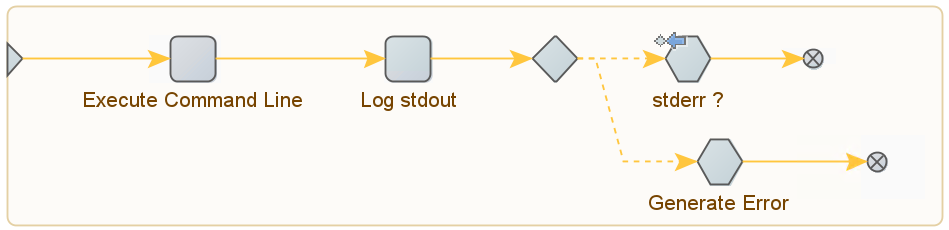

Kofax RPA Version: `11.3.0.2`

Simple robot template to run command line applications.





- Exit code and `stdout` is logged and can be inspected through **Robot Messages** menu in **Management Console**.
- Application-level errors are propagated and treated as robot errors with `stderr` value as the error message.


> [!WARNING]
> The `stderr ?` step is a **Test Value** action that can trigger the **Generate Error** action if the following condition is satisfied: 
> ```
> exit_code == 1 || length(stderr) > 0
> ```
> In most logging frameworks, e.g., Python's `logging` module, command line logs, regardless of severity, are passed to `stderr` instead of `stdout`. This can cause common diagnostic messages to trigger the **Generate Error** action. Configure your application logging handler or alter the **Test Value** condition to avoid this behavior.